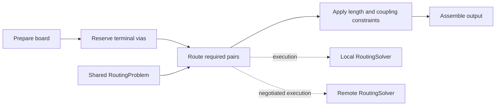

# Architecture

The rewrite keeps the public Pipeline9 solver interface around a small set of independent responsibilities. Preparation decides which physical connections are required. Search constructs copper for those connections. Geometry decides whether that copper fits. Execution and output adapters expose the same work locally, remotely, and in fixtures. These are implementation boundaries, not a reproduction of upstream internal stages or algorithms.

## Five solver stages

[`Pipeline9`](../lib/Pipeline9.ts) advances one active child through five stages. Each child follows [`BaseSolver`](../lib/solvers/BaseSolver.ts): incremental `step()`, progress, constructor parameters, and explicit solved or failed state. Legacy phase names resolve to these actual boundaries through [`legacyPhaseTargets`](../lib/legacyPhaseTargets.ts).

| Stage | Source | Responsibility |
| --- | --- | --- |
| Prepare board | [`PrepareBoardSolver`](../lib/preparation/PrepareBoardSolver.ts) | Validate and normalize input, resolve net constraints, and turn physical components into routing tasks. |
| Reserve terminal vias | [`TerminalViaSolver`](../lib/preparation/TerminalViaSolver.ts) | Satisfy explicit terminal via requests and reserve their copper before ordinary routing. |
| Route required pairs | [`HighDensityRoutingStage`](../lib/HighDensityRoutingStage.ts) | Drive the routing engine and expose numeric-layer debug snapshots of its simplified traces. |
| Apply constraints | [`LengthMatchingSolver`](../lib/postprocessing/LengthMatchingSolver.ts), [`CoupledPairSolver`](../lib/postprocessing/CoupledPairSolver.ts) | Apply requested length and coupling constraints with collision checks; fail when supported adjustments cannot satisfy them. |
| Assemble output | [`AssembleTracesSolver`](../lib/output/AssembleTracesSolver.ts) | Clone completed trace records and assign identities without colliding with fixed input traces. Geometry is already settled. |

## Electrical identity and physical connectivity

[`ConnectivityIndex`](../lib/preparation/ConnectivityIndex.ts) answers whether names refer to the same intended electrical net. An alias permits contact between conductors; it does not prove that those conductors touch. Preparation separately accounts for physical pads and fixed trace components, then builds a minimum spanning set of required pair connections. Disconnected pieces of preloaded copper must still be joined. Requested ports retain physical attachment requirements even where same-net pads overlap.

Merged connection records use a conservative whole-net constraint policy: the largest resolved nominal width and the intersection of applicable bus layer restrictions. An empty layer intersection or a terminal with no eligible layer is an explicit preparation failure. See [compatibility](compatibility.md) for resolution rules and supported constraints.

The resulting [`RoutingProblem`](../lib/routing/types.ts) contains the normalized board, required tasks, fixed copper, via dimensions, margin, and effort. Each task carries exact endpoints, electrical aliases, width, and allowed layers. Neither transport nor presentation has to reconstruct these decisions.

## Search and clearance

[`RoutingSolver`](../lib/routing/RoutingSolver.ts) owns route ordering, accumulated copper, retries, and the best completed partial pass. It starts with short connections and promotes failed tasks in later passes. Ordinary ordering runs first. Only after that bounded strategy is exhausted does a separate strategy attempt targeted rip-up: fixed pads and input copper remain hard obstacles, while a diagnostic search penalizes movable copper. A candidate may displace at most four existing routes, which return to the queue.

Each strategy permits five to eight passes according to effort. Each pair has three grid resolutions. Repair permits at most eight diagnostic attempts per pass and two per task in that pass. [`RouteSearch`](../lib/routing/RouteSearch.ts) performs weighted eight-neighbor layered A* with bounded expansions, advances at most 512 heap removals per search step, and uses exact endpoint connectors. Direct paths and visibility simplification are accepted only after continuous collision checks. These are search-work limits, not a wall-clock guarantee or a completeness/optimality claim.

[`CopperMap`](../lib/routing/CopperMap.ts) indexes nearby pads, wires, and vias; [`geometry`](../lib/routing/geometry.ts) supplies continuous distance and intersection operations. Grid occupancy alone never authorizes a segment. Checks include trace width, clearance, board boundaries, layer restrictions, and the via footprint on every copper layer. Same-net contact is allowed where appropriate; distinct same-net vias still require spacing. Rotated rectangles are supported. Oval obstacle collision checks deliberately use conservative rectangular envelopes, which can exclude otherwise feasible paths.

## Local and network execution

[`Pipeline9_Networked`](../lib/Pipeline9_Networked.ts) replaces the routing-stage execution adapter. A capability-negotiated service receives the exact `RoutingProblem` and runs the same engine. A whole board is the remote unit, preserving interactions among nets. Within-board distributed decomposition is not implemented.

The client checks request binding, returned geometry, and physical connectivity against trusted input. Electrical labels in a response cannot substitute for copper. Unsupported contracts and transport failures use explicit local fallback; valid remote routing failures remain failures. Versioned cache identity includes the exact problem. Async methods, legacy endpoint behavior, deadlines, counters, and transport draining are detailed in [network behavior](network.md).

## Failure and inspection

A failed stage prevents final-output access. Routing exhaustion retains the best partial pass, unfinished task IDs, and diagnostic statistics for inspection through the routing stage; partial copper is never reported as a completed board. Stepping a terminal solver leaves its state unchanged.

[`findTerminalContradiction`](../lib/routing/findTerminalContradiction.ts) can separately prove a narrow infeasibility case: a required terminal lies strictly inside unrelated physical copper on every eligible layer. This uses rotated rectangle or inscribed ellipse geometry, not the conservative oval envelope. Search exhaustion alone makes no infeasibility claim. [Known limitations](known-input-limitations.md) distinguish a certified input conflict from an unresolved bounded search and describe their independent fixture checks.
